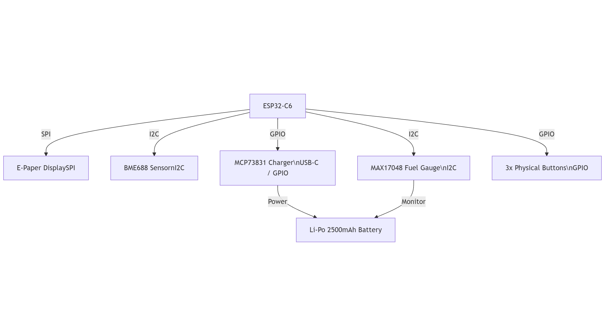

# OpenBook - eBook Reader

**Autor:** Nita Eduard-Eugen
**Data:** 06 Aprilie 2025

## Bill of Materials (BOM)

| Component                | Link                                                                                                                | Datasheet                                                                                                                                                                                                                         |
| ------------------------ | ------------------------------------------------------------------------------------------------------------------- | --------------------------------------------------------------------------------------------------------------------------------------------------------------------------------------------------------------------------------- | --------- | ------------------------------------------------------------------------------------------------- | ------------------------------------------------------------------------------------- |
| BME680                   | (https://www.snapeda.com/parts/BME680/Bosch/view-part/?welcome=home)                                                | (https://www.bosch-sensortec.com/media/boschsensortec/downloads/datasheets/bst-bme680-ds001.pdf)                                                                                                                                  |
| BUTTON                   | (https://industry.panasonic.com/global/en/products/control/switch/light-touch/number/evqpuj02k)                     | (https://www.lcsc.com/datasheet/lcsc_datasheet_2201121800_PANASONIC-EVQPUJ02K_C2936858.pdf)                                                                                                                                       | CAPACITOR | (<https://componentsearchengine.com/part-view/R0402%201%25%20100%20K%20(RC0402FR-07100KL)/YAGEO>) | (//efaidnbmnnnibpcajpcglclefindmkaj/https://www.resistor.com/assets/pdf/0402tstd.pdf) |
| R0402                    | (<https://componentsearchengine.com/part-view/R0402%201%25%20100%20K%20(RC0402FR-07100KL)/YAGEO>)                   | (/https://www.resistor.com/assets/pdf/0402tstd.pdf)                                                                                                                                                                               |
| CPH3225A                 | (https://www.snapeda.com/parts/CPH3225A/Seiko+Instruments/view-part/?ref=eda)                                       | (https://octopart.com/datasheet/cph3225a-seiko-25340571)                                                                                                                                                                          |
| EVQPUJ02K                | (https://industry.panasonic.com/global/en/products/control/switch/light-touch/number/evqpuj02k)                     | (https://www.lcsc.com/datasheet/lcsc_datasheet_2201121800_PANASONIC-EVQPUJ02K_C2936858.pdf)                                                                                                                                       |
| KP-1608SURCK             | (https://www.snapeda.com/parts/KP-1608SURCK/Kingbright/view-part/?ref=search&t=LED%200603)                          | (https://media.elv.com/file/107153_led_surck1608_data.pdf)                                                                                                                                                                        |
| USBLC6-2SC6Y             | (https://www.snapeda.com/parts/USBLC6-2SC6Y/STMicroelectronics/view-part/?ref=eda)                                  | (https://www.digikey.com/en/htmldatasheets/production/1375342/0/0/1/usblc6-2sc6y)                                                                                                                                                 |
| SD0805S020S1R0           | (https://ro.mouser.com/ProductDetail/KYOCERA-AVX/SD0805S020S1R0?qs=jCA%252BPfw4LHbpkAoSnwrdjw%3D%3D)                | (https://www.alldatasheet.com/view.jsp?Searchword=SD0805S&sField=2)                                                                                                                                                               |
| PGB1010603MR             | (https://www.snapeda.com/parts/PGB1010603MR/Littelfuse/view-part/?ref=eda)                                          | (https://www.alldatasheet.com/view.jsp?Searchword=Pgb1010603mr&gad_source=1&gbraid=0AAAAADcdDU8aYfZtfJfdZ9I5j6RwZ_cbA&gclid=Cj0KCQjwqcO_BhDaARIsACz62vOPBOBe0eOh5gDUFkkKl4JBcbmoFZYtJ8BOnbaWqr_BuUCcVWvbutAaAmGkEALw_wcB)         |
| BD5229G-TR               | (https://componentsearchengine.com/part-view/BD5229G-TR/ROHM%20Semiconductor)                                       | (https://www.lcsc.com/datasheet/lcsc_datasheet_2201131330_ROHM-Semicon-BD5229G-TR_C962636.pdf)                                                                                                                                    |
| XC6220A331MR-G           | (https://componentsearchengine.com/part-view/XC6220A331MR-G/Torex)                                                  | (https://www.alldatasheet.com/view.jsp?Searchword=Xc6220&gad_source=1&gbraid=0AAAAADcdDU8aYfZtfJfdZ9I5j6RwZ_cbA&gclid=Cj0KCQjwqcO_BhDaARIsACz62vPS06NB6tLgniZzfaVpKNu1m811BNk6AEPfg4DbP6f5S8QWA_pW_UQaAv-0EALw_wcB)               |
| USB4110-GF-A             | (<https://componentsearchengine.com/part-view/USB4110-GF-A/GCT%20(GLOBAL%20CONNECTOR%20TECHNOLOGY)>)                | (https://gct.co/files/drawings/usb4110.pdf)                                                                                                                                                                                       |
| Adafruit LEDCHIP-LED0603 | (https://eu.mouser.com/ProductDetail/Adafruit/4208?qs=PzGy0jfpSMtbScLbr0L5dw%3D%3D)                                 | (https://www.arrow.com/en/manufacturers/adafruit-industries/datasheets)                                                                                                                                                           |
| Bobina                   | (https://store.comet.srl.ro/Catalogue/Product/43497/)                                                               | (https://www.scribd.com/document/814581278/Datasheet-Bobina)                                                                                                                                                                      |
| PFMF                     | (https://www.mouser.co.uk/ProductDetail/EPCOS-TDK/B72520T0350K062?qs=dEfas%2FXlABIszF52uu7vrg%3D%3D)                | (https://ro.mouser.com/c/ds/circuit-protection/thermistors/resettable-fuses-pptc/?m=Schurter&series=PFMF)                                                                                                                         |
| DMG2305UX-7              | (https://componentsearchengine.com/part-view/DMG2305UX-7/Diodes%20Incorporated)                                     | (https://www.mouser.com/datasheet/2/115/DMG2305UX-266242.pdf?srsltid=AfmBOop22k34YTJJra1xubiU6LPiN4M4JlcWbRoSNdxSGFak8uWgXPpK)                                                                                                    |
| Si1308EDL-T1-GE3         | (https://componentsearchengine.com/part-view/SI1308EDL-T1-GE3/Vishay)                                               | (https://www.alldatasheet.com/view.jsp?Searchword=Si1308edl&gad_source=1&gbraid=0AAAAADcdDU-px713ONYSnQ2O-gcwqYcFq&gclid=Cj0KCQjwqcO_BhDaARIsACz62vN_Nz3MJOc6J_03gnVBm7aSqC8v9wyP0VD-iRKP-gFrYgdhLi99I14aAlVJEALw_wcB)            |
| MCP73831T-5ACI/OT        | (https://www.mouser.co.uk/ProductDetail/Microchip-Technology/MCP73831T-5ACI-OT?qs=hH%252BOa0VZEiAcgAcEkuamXg%3D%3D) | https://ww1.microchip.com/downloads/en/DeviceDoc/MCP73831-Family-Data-Sheet-DS20001984H.pdf)                                                                                                                                      |
| SMD Solder               | (https://grabcad.com/library/solder-jumpers-1)                                                                      | ()                                                                                                                                                                                                                                |
| W25Q512JVEIQ             | (https://www.snapeda.com/parts/ESP32-C6-WROOM-1-N8/Espressif+Systems/view-part/?ref=eda)                            | (https://www.mouser.com/datasheet/2/949/W25Q512JV_SPI_RevB_06252019_KMS-2487502.pdf?srsltid=AfmBOoquExqDVgxEELF9CzuOGxHos0CD1nQDROHD6Eebdm2foNzqozqU)                                                                             |
| ESP32-C6-WROOM-1-N8      | (https://www.snapeda.com/parts/ESP32-C6-WROOM-1-N8/Espressif+Systems/view-part/?ref=eda)                            | (https://www.mouser.com/catalog/specsheets/Espressif_ESP32_C6_WROOM_1%20_Datasheet_V0.1_PRELIMINARY_en.pdf?srsltid=AfmBOooHQKNitqODRaaPjoZInfWKTacDER1t5uRK6sKqT13TrzvVo_B7)                                                      |
| DS3231SN#                | (https://www.snapeda.com/parts/DS3231SN%23/Analog+Devices/view-part/?ref=eda)                                       | (https://www.alldatasheet.com/view.jsp?Searchword=Ds3231sn%20datasheet&gad_source=1&gbraid=0AAAAADcdDU-Gy9URfMxGmqiPg7ci5L3wR&gclid=Cj0KCQjwqcO_BhDaARIsACz62vMkK3ETSnW2w7mo0Fa-wgWJGn89AxWCyIND6k5X8MmoPl6hv6VWwT8aAiS-EALw_wcB) |
| MAX17048G+T10            | (https://www.snapeda.com/parts/MAX17048G+T10/Analog+Devices/view-part/?ref=eda)                                     | (https://www.alldatasheet.com/view.jsp?Searchword=Max17048&gad_source=1&gbraid=0AAAAADcdDU8aYfZtfJfdZ9I5j6RwZ_cbA&gclid=Cj0KCQjwqcO_BhDaARIsACz62vNa9xrVfzjCjADRwXD0RBbo4Nret3ywwteDGLJKZui8ZL8KdVlTE7caAvQxEALw_wcB)             |

## Descriere Hardware

Dispozitivul este construit în jurul microcontroller-ului **ESP32-C6**, care oferă conectivitate Wi-Fi, BLE și Thread (802.15.4).

### Componente principale:

- **ESP32-C6**: Procesorul principal, comunică prin SPI, I2C, UART, PWM cu restul componentelor.
- **Display E-Ink (4.2")**: Conectat prin SPI, redă conținutul digital. Consum foarte redus de energie.
- **AXP192**: PMIC care gestionează înărcarea bateriei, distribuția tensiunii și monitorizarea curentului.
- **BH1750**: Senzor de lumină I2C pentru ajustarea luminozității ecranului sau închiderea automata.
- **Butoane**: Legate la pini GPIO pentru interacțiune (navigare meniu, page forward/back).

- **USB-UART bridge**: Conectare serială pentru debugging/flash firmware.
- **Baterie Li-Po**: Autonomie de peste 15 ore estimată la un consum mediu de 80mA.

### Comunicație și interfețe:

- SPI: E-Ink Display
- I2C: PMIC, BH1750
- UART: Debug USB
- GPIO: Butoane

### Estimare consum energie:

- Standby: ~10 mA
- Afișare pagină: spike de ~120 mA timp de <1s
- Operare normală: ~70-90 mA
